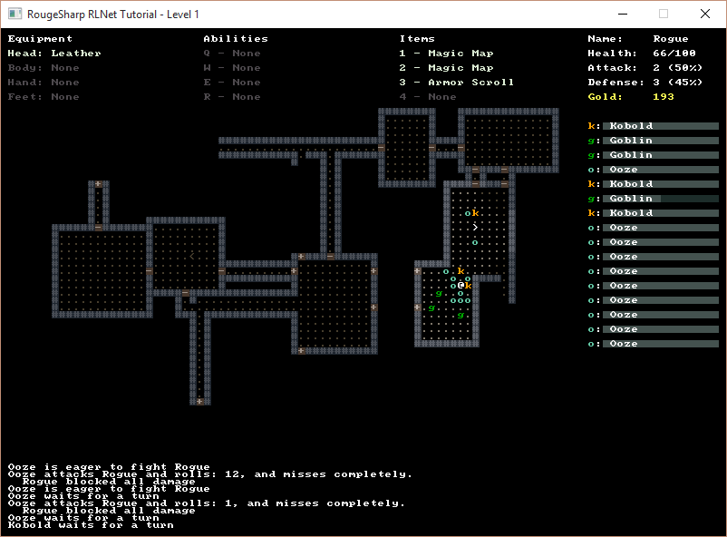

# Introduction

The links to the left will walk you through creating a rougelike game using version 3 of the RougeSharp library.

## Complete Code

The complete tutorial project is already finished and the source code is available on Github:

* Sample Roguelike game using RogueSharp and RLNet console
  * <https://github.com/FaronBracy/RogueSharpRLNetSamples>
* Sample Roguelike game using RogueSharp and SadConsole
  * <https://github.com/FaronBracy/RogueSharpSadConsoleSamples>

## Goals

The RogueSharp V3 Tutorial project was created with the following goals in mind:

* An inventory system for the player
  * Equipment slots for head, body, hands and feet
  * Item slots for consumables like potions, wands and scrolls
    * Items have a number of charges before they used up
* A robust example set of abilities that the player can learn
  * Targeted attacks like Magic Missiles that can affect single monsters at range
  * Area attacks like Fireballs that hit all monsters in an area
  * Line attacks like a Lightning bolt that can be fired through monsters
  * Healing abilities
  * Map revealing abilities
  * Melee special attacks like a whirlwind attack that hits all adjacent enemies
* An interesting set of enemies with differing AI
  * Goblins that can pick up and equip items they find
  * Enemies that flee when wounded and alert other groups of monsters to the player’s presence
  * Oozes that split into multiple copies when struck
* A unique combat system
  * Percentage based
  * Opposing rolls
* A scheduling system
  * No more I-Go / You-Go
  * Player speed changes based on the items equipped
  * Monster can vary wildly
* A messaging system
  * Show detailed combat messages in a log
* Systems for generating random levels
  * Distribution of loot and monsters based on level depth
  * Map features such as rooms, hallways, doors and stairs that can be interacted with by both the player and monsters

## Additional Resources

* Roguelike Dev SubReddit – <https://www.reddit.com/r/roguelikedev>

Also, don’t forget about the upcoming seven day roguelike. If you are interested in C# I’d love for you to try out RougeSharp this year and give me any feedback you have. If you aren’t interested in C# there are lots of other great libraries and languages out there. Whether you pick an existing one or roll your own I think you’ll have a lot of fun.

* 7DRL 2019 – <https://itch.io/jam/7drl-challenge-2019>
