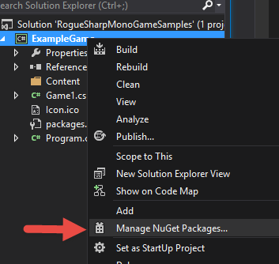
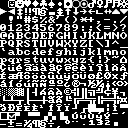
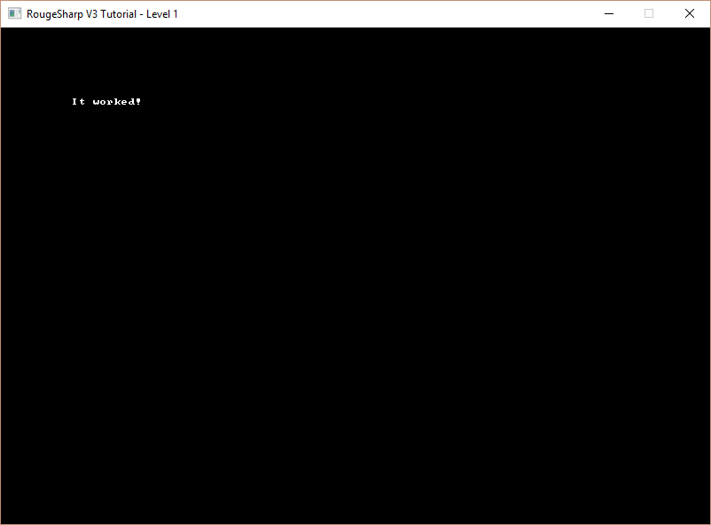

# Creating the Project

In this tutorial we’ll get the RogueSharp and RLNET NuGet packages added to a brand new project.

## Creating a new Console Project

I’ll be using Visual Studio 2015 for this project. The community edition can be found here: <https://www.visualstudio.com/en-us/products/visual-studio-community-vs.aspx>

1. Go to the **File** menu and choose **New -> Project…**
1. From **Templates** choose **Visual C# -> Windows -> Console Application**
1. Give it any name and location that want.


## Adding NuGet Packages

Both RogueSharp and RLNET are available via NuGet and are easy to add to our project.

1. **Right click** on the project (the name of your project will be whatever you named it in step 3 above)
1. Choose **Manage NuGet Packages…** from the context menu.



Now you should be able to choose **Browse** and search for **RogueSharp** and **RLNET**. Make sure that the **Package Source** dropdown is set to **nuget.org**. Click **Install** for both packages. As of this writing the latest version of RogueSharp is 3.0.0 and RLNET is 1.0.6. Note RLNet has a dependency on OpenTK so it will also install v1.1.225 of that library.

## Adding a Font File

RLNET needs a special font file like libtcod uses. If you aren’t familiar with this and want to know more about it there is [good information here](http://roguecentral.org/doryen/data/libtcod/doc/1.5.1/html2/console_set_custom_font.html?cs=true "libtcod documentation").

But for our purposes just right click and download this image and place it in your project directory.



Once the file is in your project directory, you should be able to **Right Click** on your project in Visual Studio and choose **Add -> Existing Item…** Choose the image that you saved and it should show up in the project. Make sure to set the **Properties** of this file to **Copy always**.


## The Code

A console application always includes a file called **Program.cs** which has a single **Main()** function which serves as the entry point.

Rename **Program.cs** to **Game.cs**

Now we’re going to add a bit of code to render a RLRootConsole with the text “It worked!” just to prove that we hooked up the NuGet packages correctly. I won’t go into a lot of detail here but if you want more depth check out these other tutorials.

* [RogueSharp MonoGame Tutorials](https://roguesharp.wordpress.com/)
* [RLNET Tutorials](https://clarktravism.wordpress.com/)

```cs
using RLNET;

namespace RogueSharpV3Tutorial
{
  public class Game
  {
    // The screen height and width are in number of tiles
    private static readonly int _screenWidth = 100;
    private static readonly int _screenHeight = 70;

    private static RLRootConsole _rootConsole;

    public static void Main()
    {
      // This must be the exact name of the bitmap font file we are using or it will error.
      string fontFileName = "terminal8x8.png";
      // The title will appear at the top of the console window
      string consoleTitle = "RougeSharp V3 Tutorial - Level 1";
      // Tell RLNet to use the bitmap font that we specified and that each tile is 8 x 8 pixels
      _rootConsole = new RLRootConsole( fontFileName, _screenWidth, _screenHeight,
        8, 8, 1f, consoleTitle );
      // Set up a handler for RLNET's Update event
      _rootConsole.Update += OnRootConsoleUpdate;
      // Set up a handler for RLNET's Render event
      _rootConsole.Render += OnRootConsoleRender;
      // Begin RLNET's game loop
      _rootConsole.Run();
    }

    // Event handler for RLNET's Update event
    private static void OnRootConsoleUpdate( object sender, UpdateEventArgs e )
    {
      _rootConsole.Print( 10, 10, "It worked!", RLColor.White );
    }

    // Event handler for RLNET's Render event
    private static void OnRootConsoleRender( object sender, UpdateEventArgs e )
    {
      // Tell RLNET to draw the console that we set
      _rootConsole.Draw();
    }
  }
}
```

If you run your project now you should see something like this:



Here is the link to the final code on Github:
<https://github.com/FaronBracy/RogueSharpV3Tutorial/tree/00HookupNuget>
