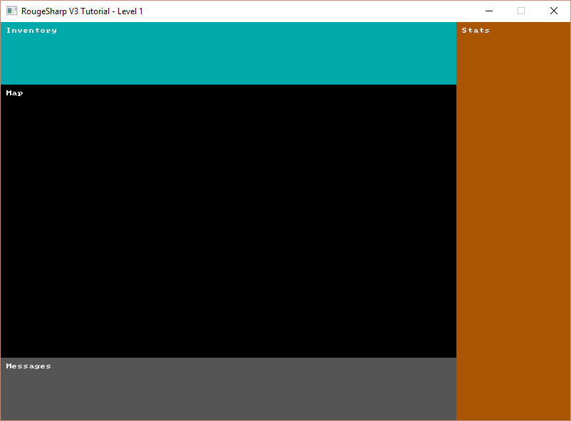

# Multiple Consoles

In this tutorial we’ll create sub consoles for each part of our game window and [Blit](https://en.wikipedia.org/wiki/Bit_blit "Bit Blit") them to the root console.



## Sub Consoles

Our game is more than a map. It will also have areas for the inventory, player statistics, and a message log. We could just draw all these directly to the root console but it will be better to draw each to their own console and [Blit](https://en.wikipedia.org/wiki/Bit_blit "Bit Blit") them to the root in their correct positions.

## Defining Console Dimensions

First we need to define the width and height of each of our sub-consoles and declare each RLConsole. At the top of `Game.cs` add the following code:

```cs
public static class Game
{
  // The screen height and width are in number of tiles
  private static readonly int _screenWidth = 100;
  private static readonly int _screenHeight = 70;
  private static RLRootConsole _rootConsole;

  // The map console takes up most of the screen and is where the map will be drawn
  private static readonly int _mapWidth = 80;
  private static readonly int _mapHeight = 48;
  private static RLConsole _mapConsole;

  // Below the map console is the message console which displays attack rolls and other information
  private static readonly int _messageWidth = 80;
  private static readonly int _messageHeight = 11;
  private static RLConsole _messageConsole;

  // The stat console is to the right of the map and display player and monster stats
  private static readonly int _statWidth = 20;
  private static readonly int _statHeight = 70;
  private static RLConsole _statConsole;

  // Above the map is the inventory console which shows the players equipment, abilities, and items
  private static readonly int _inventoryWidth = 80;
  private static readonly int _inventoryHeight = 11;
  private static RLConsole _inventoryConsole;

  // ... additional code omitted
}
```

## Instantiate the Consoles

Now we need to new up our four consoles with the widths and heights that we defined. In our `Main()` just after the line where we make a new RLRootConsole add the following code:

```cs
public static void Main()
{
  // ... previous code omitted
  // After the line that starts _rootConsole = new RLRootConsole( ...

  // Initialize the sub consoles that we will Blit to the root console
  _mapConsole = new RLConsole( _mapWidth, _mapHeight );
  _messageConsole = new RLConsole( _messageWidth, _messageHeight );
  _statConsole = new RLConsole( _statWidth, _statHeight );
  _inventoryConsole = new RLConsole( _inventoryWidth, _inventoryHeight );

  // ... additional code omitted
}
```

## Set Background Color and Label

Next we’ll want to set the background color of each console and put a label on them so that we can verify that they are in the correct positions when we Blit them to the Root console. In `OnRootConsoleUpdate()` replace `_rootConsole.Print( 10, 10, “It worked!”, RLColor.White );` with the following code:

```cs
private static void OnRootConsoleUpdate( object sender, UpdateEventArgs e )
{
  // Set background color and text for each console
  // so that we can verify they are in the correct positions
  _mapConsole.SetBackColor( 0, 0, _mapWidth, _mapHeight, RLColor.Black );
  _mapConsole.Print( 1, 1, "Map", RLColor.White );

  _messageConsole.SetBackColor( 0, 0, _messageWidth, _messageHeight, RLColor.Gray );
  _messageConsole.Print( 1, 1, "Messages", RLColor.White );

  _statConsole.SetBackColor( 0, 0, _statWidth, _statHeight, RLColor.Brown );
  _statConsole.Print( 1, 1, "Stats", RLColor.White );

  _inventoryConsole.SetBackColor( 0, 0, _inventoryWidth, _inventoryHeight, RLColor.Cyan );
  _inventoryConsole.Print( 1, 1, "Inventory", RLColor.White );
}
```

## Blit and Render

The final step we’ll need to take is to update **OnRootConsoleRender()** to Blit each of our consoles to the root console in the correct positions. The RLNET method we will use is RLConsole.Blit which takes several parameters.

A source console

* The X and Y position of the top left corner of a rectangular area from the source
* The width and height of the rectangular area from the source that we will be Blitting
* A destination console to Blit to
* The X and Y position of the top left corner of where we will Blit to in the destination console

```cs
private static void OnRootConsoleRender( object sender, UpdateEventArgs e )
{
  // Blit the sub consoles to the root console in the correct locations
  RLConsole.Blit( _mapConsole, 0, 0, _mapWidth, _mapHeight,
    _rootConsole, 0, _inventoryHeight );
  RLConsole.Blit( _statConsole, 0, 0, _statWidth, _statHeight,
    _rootConsole, _mapWidth, 0 );
  RLConsole.Blit( _messageConsole, 0, 0, _messageWidth, _messageHeight,
    _rootConsole, 0, _screenHeight - _messageHeight );
  RLConsole.Blit( _inventoryConsole, 0, 0, _inventoryWidth, _inventoryHeight,
    _rootConsole, 0, 0 );

  // Tell RLNET to draw the console that we set
  _rootConsole.Draw();
}
```

And that’s it! If you run the program now you should see output similar to the screenshot at the beginning of this post.

Complete code for this post – <https://github.com/FaronBracy/RogueSharpV3Tutorial/tree/01SetupConsoles>

### Closing thoughts

So far we haven’t used RogueSharp at all. I think it is necessary to do some of these basic setup tasks to pave the way for the future. Don’t worry though we’ll be getting into RogueSharp functionality shortly.
