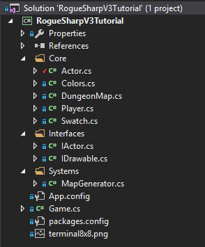
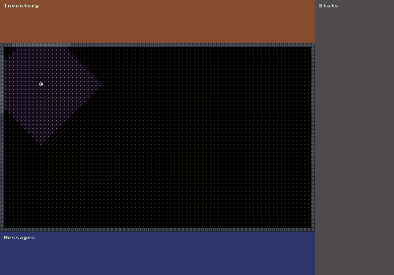

# Player

During this tutorial we’ll create interfaces for Actors and for Drawing things. We’ll then create a simple Player class that implements both of our new interfaces. We’ll draw the Player and his field of view to the screen but we will not get into accepting keyboard input and moving the Player until next time.

## Creating the Interfaces

There are two new interfaces that we want to create. In C# interfaces are used to define a set of functionality or a group of related behaviors. You can think of them as a contract that classes must follow. By implementing the interface a Class is agreeing to the contract and must implement those methods and behaviors. We will always prefix our interfaces with the letter ‘I’ as is common in C#.

### IActor Interface

The first interface we will create will be `IActor`. For now it will only have two properties, `Name` and `Awareness`. The `Awareness` property will be used when calculating field-of-view to determine the maximum distance the Actor is aware of, can see or sense.

Create a **new folder** called `Interfaces` and then create a new interface in the folder called `IActor.cs`. Place the following code inside the new file.

```cs
namespace RogueSharpV3Tutorial.Interfaces
{
  public interface IActor
  {
    string Name { get; set; }
    int Awareness { get; set; }
  }
}
```

### IDrawable Interface

The next interface we will define will be `IDrawable`. The properties that we need to draw a cell in the console are a `Color`, `Symbol`, and the `X` and `Y` coordinates of the cell. We also want to have a `Draw` method that will take the `RLConsole` to draw to as well an `IMap`. Notice that we don’t require a concrete `Map` class but we will accept any class that follows the `IMap` contract. The `IMap` is important because that will allow us to calculate field-of-view.

```cs
namespace RogueSharpV3Tutorial.Interfaces
{
  public interface IDrawable
  {
    RLColor Color { get; set; }
    char Symbol { get; set; }
    int X { get; set; }
    int Y { get; set; }

    void Draw( RLConsole console, IMap map );
  }
}
```

## Actor Base Class

Now that we have defined our interfaces we’ll make a base class called Actor that implements both of our interfaces. In C# a class can only inherit from a single class. It can however implement as many interfaces as you want.

Start by creating a new class in the `Core` folder called `Actor.cs`. It should implement both `IActor` and `IDrawable`. Place the following code in `Actor.cs`:

```cs
public class Actor : IActor, IDrawable
{
  // IActor
  public string Name { get; set; }
  public int Awareness { get; set; }

  // IDrawable
  public RLColor Color { get; set; }
  public char Symbol { get; set; }
  public int X { get; set; }
  public int Y { get; set; }
  public void Draw( RLConsole console, IMap map )
  {
    // Don't draw actors in cells that haven't been explored
    if ( !map.GetCell( X, Y ).IsExplored )
    {
      return;
    }

    // Only draw the actor with the color and symbol when they are in field-of-view
    if ( map.IsInFov( X, Y ) )
    {
      console.Set( X, Y, Color, Colors.FloorBackgroundFov, Symbol );
    }
    else
    {
      // When not in field-of-view just draw a normal floor
      console.Set( X, Y, Colors.Floor, Colors.FloorBackground, '.' );
    }
  }
}
```

Implementing the properties should be straightforward. They just have public getters and setters. The most interesting part will be the Draw() method because it needs to inspect the IMap for explored cells and cells in field-of-view so that it can draw the appropriate symbols.

## Player Color

We need to establish a `Color` for our `Player`. Open `Colors.cs` and add the following line:

```cs
public static RLColor Player = Swatch.DbLight;
```

## Player Class

It’s time to create the `Player` class. In the `Core` folder make a new class called `Player.cs`. We want it to have a base class of `Actor` so that it will automatically get the `Draw()` method and all the necessary properties. The code should look like this.

```cs
namespace RogueSharpV3Tutorial.Core
{
  public class Player : Actor
  {
    public Player()
    {
      Awareness = 15;
      Name = "Rogue";
      Color = Colors.Player;
      Symbol = '@';
      X = 10;
      Y = 10;
    }
  }
}
```

You’ll see that all we have to do to make the `Player` unique from other `Actor`s is to define unique values for our properties. In this case the `Player` can see 15 cells so the `Awareness` is 15. We’re also setting the starting position to 10, 10 and the `Color` to the one we defined earlier. The `Symbol` is the standard ‘@’ character from the original Rogue. Feel free to adjust any of these values to anything you want.

If you’ve been following along with the tutorial your project structure should now look like this:



### Player Field-of-View Method

Open `DungeonMap.cs` and create a new method called `UpdatePlayerFieldOfView()` which will be called when we position the `Player`

```cs
// This method will be called any time we move the player to update field-of-view
public void UpdatePlayerFieldOfView()
{
  Player player = Game.Player;
  // Compute the field-of-view based on the player's location and awareness
  ComputeFov( player.X, player.Y, player.Awareness, true );
  // Mark all cells in field-of-view as having been explored
  foreach ( Cell cell in GetAllCells() )
  {
    if ( IsInFov( cell.X, cell.Y ) )
    {
      SetCellProperties( cell.X, cell.Y, cell.IsTransparent, cell.IsWalkable, true );
    }
  }
}
```

## Adding the Player to the Game

The last thing that we have to do in this tutorial is add the `Player` to the `Game`. Open `Game.cs` and add a `Player` property just above our existing `DungeonMap` property.

```cs
public static Player Player { get; private set; }
```

Next we need to construct a new `Player` in our `Main()` method. Don’t forget to update the field-of-view by calling `DungeonMap.UpdatePlayerFieldOfView()`.

```cs
Player = new Player();
// The next two lines already existed
MapGenerator mapGenerator = new MapGenerator( _mapWidth, _mapHeight );
DungeonMap = mapGenerator.CreateMap();
// End of existing code
DungeonMap.UpdatePlayerFieldOfView();
```

We’re almost done. The last thing we need to do is call `Player.Draw()` in our `OnRootConsoleRender()` method.

```cs
Player.Draw( _mapConsole, DungeonMap );
```

If all went well when you start your game you should see this:



The code after all of the changes so far can be found here:
<https://github.com/FaronBracy/RogueSharpV3Tutorial/tree/04PlayerActor>
