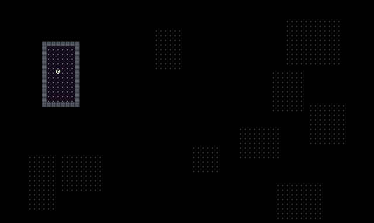
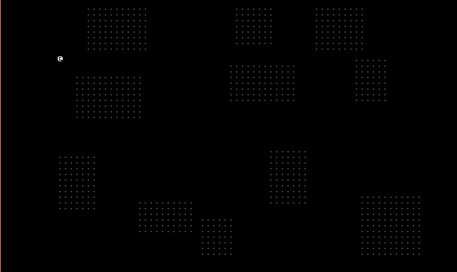

# Simple Room Generation

During this tutorial we’ll handle adding rooms to our map. We’ll save connecting the rooms via hallways until the next tutorial.

## Dungeon Map Rooms

The first thing we’ll need to do is create a place to hold our room information in `DungeonMap.cs`. Since all of our rooms are going to start out simple and be rectangular in nature we’ll simple use the `Rectangle` class included with `RogueSharp` to represent a room.

Some of you might ask why `Rectangle` in `RogueSharp` is a `class` and not a `struct` like in many other libraries. The answer is that it’s a mistake on my part. It really should be a `struct`. Here is an article on MSDN explaining the difference and when to use one over the other.

Choosing Between Class and Struct:
<https://msdn.microsoft.com/en-us/library/ms229017(v=vs.110).aspx>

Thanks to James Neal for pointing this out and for submitting a pull request to fix it. For our purposes it will work just fine as a `class`. On to creating our rooms! Add the following code to `DungeonMap.cs`.

```cs
public class DungeonMap : Map
{
  // ... start of new code
  public List<Rectangle> Rooms;

  public DungeonMap()
  {
    // Initialize the list of rooms when we create a new DungeonMap
    Rooms = new List<Rectangle>();
  }
  // ... old code continues here
}
```

## Random Number Generator Singleton

Since our levels will be randomly generated it will be nice to have easy access to a random number generator. By using the same random number generator that was created with a known seed we can always regenerate a level exactly as it was generated before by using the same seed. Open `Game.cs` and add the following code:

```cs
// Singleton of IRandom used throughout the game when generating random numbers
public static IRandom Random { get; private set; }

public static void Main()
{
  // Establish the seed for the random number generator from the current time
  int seed = (int) DateTime.UtcNow.Ticks;
  Random = new DotNetRandom( seed );

  // The title will appear at the top of the console window
  // also include the seed used to generate the level
  string consoleTitle = $"RougeSharp V3 Tutorial - Level 1 - Seed {seed}";

  // ... old code continues here
}
```

`RogueSharp` has [several different random number generators that you can read about](../api/RogueSharp.Random.yml).

For our purposes we’ll use `DotNetRandom` which uses the standard RNG included with .NET. To establish a unique seed each time we start a new game we’ll get the Ticks (The value of this property represents the number of 100-nanosecond intervals that have elapsed since 12:00:00 midnight, January 1, 0001) of the current time. We’re also writing this seed into the title so that we could generate the level again in the future which could be useful for testing or debugging.

## Generating Rooms with MapGenerator.cs

If you remember previously we generated our map by only making the outside edges walls, and the entire rest of the map wide open floors. Because we are changing this completely I’m going to paste the entire source code for the new `MapGenerator.cs` below and then I’ll review the changes.

```cs
public class MapGenerator
{
  private readonly int _width;
  private readonly int _height;
  private readonly int _maxRooms;
  private readonly int _roomMaxSize;
  private readonly int _roomMinSize;

  private readonly DungeonMap _map;

  // Constructing a new MapGenerator requires the dimensions of the maps it will create
  // as well as the sizes and maximum number of rooms
  public MapGenerator( int width, int height,
  int maxRooms, int roomMaxSize, int roomMinSize )
  {
    _width = width;
    _height = height;
    _maxRooms = maxRooms;
    _roomMaxSize = roomMaxSize;
    _roomMinSize = roomMinSize;
    _map = new DungeonMap();
  }

  // Generate a new map that places rooms randomly
  public DungeonMap CreateMap()
  {
    // Set the properties of all cells to false
    _map.Initialize( _width, _height );

    // Try to place as many rooms as the specified maxRooms
    // Note: Only using decrementing loop because of WordPress formatting
    for ( int r = _maxRooms; r > 0; r-- )
    {
      // Determine the size and position of the room randomly
      int roomWidth = Game.Random.Next( _roomMinSize, _roomMaxSize );
      int roomHeight = Game.Random.Next( _roomMinSize, _roomMaxSize );
      int roomXPosition = Game.Random.Next( 0, _width - roomWidth - 1 );
      int roomYPosition = Game.Random.Next( 0, _height - roomHeight - 1 );

      // All of our rooms can be represented as Rectangles
      var newRoom = new Rectangle( roomXPosition, roomYPosition,
        roomWidth, roomHeight );

      // Check to see if the room rectangle intersects with any other rooms
      bool newRoomIntersects = _map.Rooms.Any( room => newRoom.Intersects( room ) );

      // As long as it doesn't intersect add it to the list of rooms
      if ( !newRoomIntersects )
      {
        _map.Rooms.Add( newRoom );
      }
    }
    // Iterate through each room that we wanted placed
    // call CreateRoom to make it
    foreach ( Rectangle room in _map.Rooms )
    {
      CreateRoom( room );
    }

    return _map;
  }

  // Given a rectangular area on the map
  // set the cell properties for that area to true
  private void CreateRoom( Rectangle room )
  {
    for ( int x = room.Left + 1; x < room.Right; x++ )
    {
      for ( int y = room.Top + 1; y < room.Bottom; y++ )
      {
        _map.SetCellProperties( x, y, true, true, true );
      }
    }
  }
}
```

You’ll notice that we added 3 new parameters to the `MapGenerator` constructor. The new parameters are `maxRooms`, `roomMaxSize`, and `roomMinSize`. The way this algorithm works is it will try to create a number of rooms up to `maxRooms` on the map. Each room it will try to place in a random position on the map. It will also choose a width and height for the room between `roomMinSize` and `roomMaxSize`. The final step when placing the room is to see if it overlaps with any other room. If it does overlap then we throw it out.

## Hooking up the MapGenerator

Technically the `MapGenerator` is already used in `Game.cs` however if you tried to build you would get errors. We need to make sure we provide the new parameters that our `MapGenerator` requires. In `Game.cs` update the following line:

```cs
// Old code to change
MapGenerator mapGenerator = new MapGenerator( _mapWidth, _mapHeight );

// New code to replace with
MapGenerator mapGenerator = new MapGenerator( _mapWidth, _mapHeight, 20, 13, 7 );
```

We’ll attempt to create 20 rooms with sides that are between 7 and 13 cells long. The result should be less than 20 rooms as we throw out any that overlap.

## Results

If you run the program now and you are lucky you’ll end up with the Rogue in a room and will be able to move around in that room. Unfortunately since the rooms are not connected you will not be able to leave the room.



If you’re not so lucky you’ll end up with your poor Rogue being stuck in a wall outside of the room.
OutsideOfRoomBug



We’ll fix this issue in the next tutorial post where we’ll also get all of our rooms connected. If you are bored waiting for the next tutorial you should try and see if you can come up with a fix for this and also start experimenting with ways to connect the rooms.

## Code on GitHub

As always the code for the tutorial series so far can be found on GitHub:

* <https://github.com/FaronBracy/RogueSharpV3Tutorial/tree/06Rooms>

Bored waiting for the next tutorial? The complete tutorial project is already finished and the source code is available on Github:

* Sample Roguelike game using RogueSharp and RLNet console
  * <https://github.com/FaronBracy/RogueSharpRLNetSamples>
* Sample Roguelike game using RogueSharp and SadConsole
  * <https://github.com/FaronBracy/RogueSharpSadConsoleSamples>
