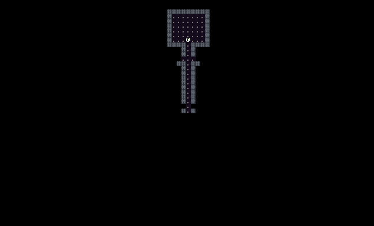
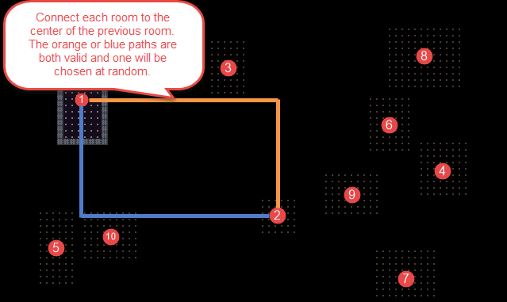

# Connecting Rooms with Hallways

During this tutorial we’ll connect the rooms we created in the last tutorial with hallways. We’ll also fix the bug that we introduced last time where the player could end up starting stuck in a solid wall.



## Player Starting Location

Our strategy for choosing the player’s starting location is going to be very simple. We will place the player in the center of the first room that we generate on our map. Before we do that we’ll need a few new methods for dealing with player placement.

First in `Game.cs` we need to get rid of a couple of things. We’re going to have our `MapGenerator` be responsible for creating and placing the `Player` instead of the `Game` class.

```cs
// Make sure that the setter for Player is not private
public static Player Player { get; set; }

// In Main() remove this line
Player = new Player();
```

Next open `DungeonMap.cs` and make a new method called `AddPlayer()` that will be ready to be used by our `MapGenerator`.

```cs
// Called by MapGenerator after we generate a new map to add the player to the map
public void AddPlayer( Player player )
{
  Game.Player = player;
  SetIsWalkable( player.X, player.Y, false );
  UpdatePlayerFieldOfView();
}
```

Last we need to add a new private method to `MapGenerator.cs` called `PlacePlayer()` which will be responsible for generating the player in the center of the first room of the map.

```cs
// Find the center of the first room that we created and place the Player there
private void PlacePlayer()
{
  Player player = Game.Player;
  if ( player == null )
  {
    player = new Player();
  }

  player.X = _map.Rooms[0].Center.X;
  player.Y = _map.Rooms[0].Center.Y;

  _map.AddPlayer( player );
}
```

Don’t forget to call this private method from `CreateMap()` right after the code where we create rooms.

```cs
// ... Old existing code ...
foreach ( Rectangle room in _map.Rooms )
{
  CreateRoom( room );
}

// New code starts here
PlacePlayer();
```

If you run the game now you should see that the player always starts in the center of a room. No more getting stuck in walls. Bug fixed!

## Connecting Rooms

Next we are going to make an algorithm that will dig tunnels to create hallways between our rooms. The way that we will do this is by creating an ‘L’ shaped hallway from the center of one room to the center of the previous room that we generated. There are two possible ‘L’ shaped hallways that we can tunnel out as illustrated in the image below. We’ll just choose one of the two at random.



One thing to keep in mind that might not be obvious is that our rooms were not generated in a neat fashion from left to right and top to bottom. They will be scattered all over the map. It is extremely likely that as we tunnel out new hallways we’ll pass through other existing rooms. This is fine though and actually creates a nice effect.

Open `MapGenerator.cs` and add two helper methods `CreateHorizontalTunnel()` and `CreateVerticalTunnel()` to help facilitate our hallway creation.

```cs
// Carve a tunnel out of the map parallel to the x-axis
private void CreateHorizontalTunnel( int xStart, int xEnd, int yPosition )
{
  for ( int x = Math.Min( xStart, xEnd ); x <= Math.Max( xStart, xEnd ); x++ )
  {
    _map.SetCellProperties( x, yPosition, true, true );
  }
}

// Carve a tunnel out of the map parallel to the y-axis
private void CreateVerticalTunnel( int yStart, int yEnd, int xPosition )
{
  for ( int y = Math.Min( yStart, yEnd ); y <= Math.Max( yStart, yEnd ); y++ )
  {
    _map.SetCellProperties( xPosition, y, true, true );
  }
}
```

Now add code to the `CreateMap()` method after the part where we generate the rooms that will use our helper methods to generate the tunnels between rooms.

```cs
// Iterate through each room that was generated
// Don't do anything with the first room, so start at r = 1 instead of r = 0
for ( int r = 1; r < _map.Rooms.Count; r++ )
{
  // For all remaining rooms get the center of the room and the previous room
  int previousRoomCenterX = _map.Rooms[r - 1].Center.X;
  int previousRoomCenterY = _map.Rooms[r - 1].Center.Y;
  int currentRoomCenterX = _map.Rooms[r].Center.X;
  int currentRoomCenterY = _map.Rooms[r].Center.Y;

  // Give a 50/50 chance of which 'L' shaped connecting hallway to tunnel out
  if ( Game.Random.Next( 1, 2 ) == 1 )
  {
    CreateHorizontalTunnel( previousRoomCenterX, currentRoomCenterX, previousRoomCenterY );
    CreateVerticalTunnel( previousRoomCenterY, currentRoomCenterY, currentRoomCenterX );
  }
  else
  {
    CreateVerticalTunnel( previousRoomCenterY, currentRoomCenterY, previousRoomCenterX );
    CreateHorizontalTunnel( previousRoomCenterX, currentRoomCenterX, currentRoomCenterY );
  }
}
```

Run the game. If everything went well you should get an image that looks like the one at the top of this post. Use the arrow keys to run around and explore the map.

*Note: If your rooms are showing up before you move to explore them make sure to set the IsExplored flag to false in the `CreateRoom()` method*

## Code on GitHub

As always the code for the tutorial series so far can be found on GitHub:

* <https://github.com/FaronBracy/RogueSharpV3Tutorial/tree/07ConnectingRooms>

Bored waiting for the next tutorial? The complete tutorial project is already finished and the source code is available on Github:

* Sample Roguelike game using RogueSharp and RLNet console
  * <https://github.com/FaronBracy/RogueSharpRLNetSamples>
* Sample Roguelike game using RogueSharp and SadConsole
  * <https://github.com/FaronBracy/RogueSharpSadConsoleSamples>
