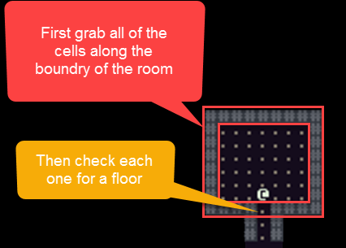
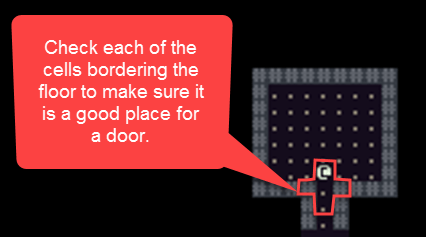

# Doors

The purpose of this tutorial is to start placing doors in our dungeon. We want the doors to start out simple but be able to be expanded upon in the future.

* Doors can have 2 states: open or closed
* All doors start as closed
* A closed door blocks field-of-view
* A door can be opened by any actor (Player or Monster)
* Once a door is opened it cannot be closed again
* An actor entering the same cell as a door will open it automatically
* The symbol for a closed door will be a plus sign “+”
* The symbol for an open door will be a minus sign “-“

## Setting Door Colors

We already set up the swatch of colors to use in our game but we never specified which colors doors should be. Let’s do that now. Open `Colors.cs` and add the following code to pick colors from the Swatch for different parts of the door.

```cs
public static RLColor DoorBackground = Swatch.ComplimentDarkest;
public static RLColor Door = Swatch.ComplimentLighter;
public static RLColor DoorBackgroundFov = Swatch.ComplimentDarker;
public static RLColor DoorFov = Swatch.ComplimentLightest;
```

## Creating the Door Class

Next we need a new class to represent all of the properties of a door that we outlined in our goals at the beginning. The door class should inherit from `IDrawable` because we will want to draw it on the map console. Create a new file named `Door.cs` in the `Core` folder and place the following code in it.

```cs
public class Door : IDrawable
{
  public Door()
  {
    Symbol = '+';
    Color = Colors.Door;
    BackgroundColor = Colors.DoorBackground;
  }
  public bool IsOpen { get; set; }

  public RLColor Color { get; set; }
  public RLColor BackgroundColor { get; set; }
  public char Symbol { get; set; }
  public int X { get; set; }
  public int Y { get; set; }

  public void Draw( RLConsole console, IMap map )
  {
    if ( !map.GetCell( X, Y ).IsExplored )
    {
      return;
    }

    Symbol = IsOpen ? '-' : '+';
    if ( map.IsInFov( X, Y ) )
    {
      Color = Colors.DoorFov;
      BackgroundColor = Colors.DoorBackgroundFov;
    }
    else
    {
      Color = Colors.Door;
      BackgroundColor = Colors.DoorBackground;
    }

    console.Set( X, Y, Color, BackgroundColor, Symbol );
  }
}
```

Notice that we use the colors and symbols for the door that we determined earlier.

## Updating the DungeonMap Class

Before we can start placing doors in our dungeon it’s important to add a few helper methods to our DungeonMap class for working with doors. Open `DungeonMap.cs` and add the following lines of code.

First add a new public property to the class at the top where we already have a list of rooms.

```cs
public List<Door> Doors { get; set; }
```

Be sure to initialize this list in the constructor

```cs
public DungeonMap()
{
  // Previous constructor code omitted...

  Doors = new List<Door>();
}
```

Next we need to add two new methods to the class. `GetDoor(…)` and `OpenDoor(…)`

```cs
// Return the door at the x,y position or null if one is not found.
public Door GetDoor( int x, int y )
{
  return Doors.SingleOrDefault( d => d.X == x && d.Y == y );
}

// The actor opens the door located at the x,y position
private void OpenDoor( Actor actor, int x, int y )
{
  Door door = GetDoor( x, y );
  if ( door != null && !door.IsOpen )
  {
    door.IsOpen = true;
    var cell = GetCell( x, y );
    // Once the door is opened it should be marked as transparent and no longer block field-of-view
    SetCellProperties( x, y, true, cell.IsWalkable, cell.IsExplored );

    Game.MessageLog.Add( $"{actor.Name} opened a door" );
  }
}
```

Last we need to update `SetActorPosition(…)` and call a the new method `OpenDoor(…)` which we just made. Call this immediately after `SetIsWalkable(…)`.

```cs
// Returns true when able to place the Actor on the cell or false otherwise
public bool SetActorPosition( Actor actor, int x, int y )
{
  // Previous code omitted...

  // Try to open a door if one exists here
  OpenDoor( actor, x, y );
}
```

>[!NOTE]
>Thanks to rmcrackan for pointing out that I forgot to show updating the `Draw(…)` method to have a foreach loop for drawing each of the doors.

```cs
foreach ( Door door in Doors )
{
  door.Draw( mapConsole, this );
}
```

## Door Placement Strategy

Now that we are reasonably confident that we can draw doors and we have a few helper methods for working with them, how do we know where to put them? Think about where doors are placed in regard to rooms. They should be on an outer wall. So we should start by getting all of the cells along the boundaries of our rooms.



Once we have all of those cells we should look for any open floors that would be a good candidate for a door. And how do we know if a door should go there or not? We look at the floor’s neighboring cells to see if it fits.



A good Cell for a door placement is one that has two walls across from each other and two floors as opposing neighbors.

## Updating the MapGenerator Class

Lets take the strategy that we just outlined for creating door and actually write the code. Open `MapGenerator.cs` and add the following new methods.

```cs
private void CreateDoors( Rectangle room )
{
  // The the boundries of the room
  int xMin = room.Left;
  int xMax = room.Right;
  int yMin = room.Top;
  int yMax = room.Bottom;

  // Put the rooms border cells into a list
  List<Cell> borderCells = _map.GetCellsAlongLine( xMin, yMin, xMax, yMin ).ToList();
  borderCells.AddRange( _map.GetCellsAlongLine( xMin, yMin, xMin, yMax ) );
  borderCells.AddRange( _map.GetCellsAlongLine( xMin, yMax, xMax, yMax ) );
  borderCells.AddRange( _map.GetCellsAlongLine( xMax, yMin, xMax, yMax ) );

  // Go through each of the rooms border cells and look for locations to place doors.
  foreach ( Cell cell in borderCells )
  {
    if ( IsPotentialDoor( cell ) )
    {
      // A door must block field-of-view when it is closed.
      _map.SetCellProperties( cell.X, cell.Y, false, true );
      _map.Doors.Add( new Door
      {
        X = cell.X,
        Y = cell.Y,
        IsOpen = false
      } );
    }
  }
}

// Checks to see if a cell is a good candidate for placement of a door
private bool IsPotentialDoor( Cell cell )
{
  // If the cell is not walkable
  // then it is a wall and not a good place for a door
  if ( !cell.IsWalkable )
  {
    return false;
  }

  // Store references to all of the neighboring cells
  Cell right = _map.GetCell( cell.X + 1, cell.Y );
  Cell left = _map.GetCell( cell.X - 1, cell.Y );
  Cell top = _map.GetCell( cell.X, cell.Y - 1 );
  Cell bottom = _map.GetCell( cell.X, cell.Y + 1 );

  // Make sure there is not already a door here
  if ( _map.GetDoor( cell.X, cell.Y ) != null ||
      _map.GetDoor( right.X, right.Y ) != null ||
      _map.GetDoor( left.X, left.Y ) != null ||
      _map.GetDoor( top.X, top.Y ) != null ||
      _map.GetDoor( bottom.X, bottom.Y ) != null )
  {
    return false;
  }

  // This is a good place for a door on the left or right side of the room
  if ( right.IsWalkable && left.IsWalkable && !top.IsWalkable && !bottom.IsWalkable )
  {
    return true;
  }

  // This is a good place for a door on the top or bottom of the room
  if ( !right.IsWalkable && !left.IsWalkable && top.IsWalkable && bottom.IsWalkable )
  {
    return true;
  }
  return false;
}
```

That’s quite a bit of code but I hope that the comments help to understand what it is accomplishing. Now that we have the methods in place, we need to remember to call them. In the CreateMap() method we have a foreach where we call CreateRoom() on each room in the map. We also need to put a call for CreateDoors() in there.

```cs
// Iterate through each room that we wanted placed
// and dig out the room and create doors for it.
foreach ( Rectangle room in _map.Rooms )
{
  CreateRoom( room );
  CreateDoors( room );
}
```

If we run the program now we should see our doors in place and working as expected!


## Code on GitHub

As always the code for the tutorial series so far can be found on GitHub:

* <https://github.com/FaronBracy/RogueSharpV3Tutorial/tree/15Doors>

Bored waiting for the next tutorial? The complete tutorial project is already finished and the source code is available on Github:

* Sample Roguelike game using RogueSharp and RLNet console
  * <https://github.com/FaronBracy/RogueSharpRLNetSamples>
* Sample Roguelike game using RogueSharp and SadConsole
  * <https://github.com/FaronBracy/RogueSharpSadConsoleSamples>
