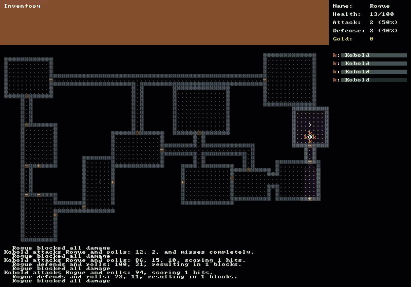

# Stairs

The purpose of this tutorial is start placing stairs in our dungeon. We want to be able to proceed down stairs to get into deeper and more difficult levels.

* Stairs can either go up or down
* The symbol for stairs going down will be a greater than sign “>”
* The symbol for stairs going up will be a less than sign “<“
* Each dungeon level will have one up and one down staircase
* Stairs going down can be descended by the player by pressing the ‘>’ or ‘.’ key
* Once a player has gone down to the next level they cannot go back
* Stairs going up are only used to indicate where the player came from
* When a player goes down stairs a brand new level is generated

## Creating the Stairs Class

To begin we need a new class to represent the stairs as we outlined in our goals above. The stairs class should inherit from `IDrawable` because we will want to draw it on the map console. Create a new file named `Stairs.cs` in the `Core` folder and place the following code in it.

```cs
public class Stairs : IDrawable
{
  public RLColor Color
  {
    get; set;
  }
  public char Symbol
  {
    get; set;
  }
  public int X
  {
    get; set;
  }
  public int Y
  {
    get; set;
  }
  public bool IsUp
  {
    get; set;
  }

  public void Draw( RLConsole console, IMap map )
  {
    if ( !map.GetCell( X, Y ).IsExplored )
    {
      return;
    }

    Symbol = IsUp ? '<' : '>';

    if ( map.IsInFov( X, Y ) )
    {
      Color = Colors.Player;
    }
    else
    {
      Color = Colors.Floor;
    }

    console.Set( X, Y, Color, null, Symbol );
  }
}
```

## Updating DungeonMap Class

Now that our `Stairs` class is created, we need to update `DungeonMap.cs` with a few changes to be able to use the `Stairs`. At the top of `DungeonMap.cs` add the following two properties for our `StairsUp` and `StairsDown` next to the existing `Rooms` and `Doors` properties.

```cs
public Stairs StairsUp { get; set; }
public Stairs StairsDown { get; set; }
```

Next update the `DungeonMap` constructor to call `Clear()` on the `SchedulingSystem` when a new `DungeonMap` is constructed. We do this because when we make a new level by going down stairs we want to make sure that all of the monsters from the previous level are removed from the schedule and do not continue to try to act.

```cs
public DungeonMap()
{
  Game.SchedulingSystem.Clear();

  // Previous code omitted...
}
```

Now we need a new method which will check to see if the player is standing on the stairs going down. Create a method called `CanMoveDownToNextLevel()` with the following code.

```cs
public bool CanMoveDownToNextLevel()
{
  Player player = Game.Player;
  return StairsDown.X == player.X && StairsDown.Y == player.Y;
}
```

In the Doors tutorial last time we forgot to update the `Draw()` method and had to have a blog reader point out the mistake. We’ll try not to make the same mistake this time. Update the `Draw()` method and add the following lines of code to draw the stairs.

```cs
// Add the following code after we finish drawing doors.
StairsUp.Draw( mapConsole, this );
StairsDown.Draw( mapConsole, this );
```

## Updating the MapGenerator Class

The next class we need to update is `MapGenerator`. We need to make sure that when we generate new maps, stairs are created along with the rest of the dungeon features. Open `MapGenerator.cs` and create a new private method named `CreateStairs()`.

```cs
private void CreateStairs()
{
  _map.StairsUp = new Stairs
  {
    X = _map.Rooms.First().Center.X + 1,
    Y = _map.Rooms.First().Center.Y,
    IsUp = true
  };
  _map.StairsDown = new Stairs
  {
    X = _map.Rooms.Last().Center.X,
    Y = _map.Rooms.Last().Center.Y,
    IsUp = false
  };
}
```

We are not doing anything too fancy to generate the stairs. We are creating the stairs up in the center of the first room that was generated. This is the same room that the player starts in and the player is also in the center of the room, so we’ll offset the X coordinate by 1 to put the stairs next to the player. The last room we generated gets stairs going down and again we place them in the center of the room.

Make sure to call the `CreateStairs()` method from the existing `CreateMap()` method right before calling `PlacePlayer()`;

```cs
public DungeonMap CreateMap()
{
  // Previous code omitted...

  // Call right before calling PlacePlayer();
  CreateStairs();

  // Previous code
  PlacePlayer();
}
```

Also we want to change the signature of the `MapGenerator` constructor and add an additional integer parameter called `mapLevel`.

```cs
public MapGenerator( int width, int height, int maxRooms, int roomMaxSize, int roomMinSize, int mapLevel )
{
  // Keep all existing code in the constructor
}
```

If you have any sort of static analysis on like FxCop it will complain about having an unused parameter in the method. We really shouldn’t add it until we are prepared to use it, but rest assured we will use it very soon.

## Updating the Game Class

Open up `Game.cs` which will be the final class that we need to update. Start by adding a new private static int member variable in with the rest of the member variables at the top of the class.

```cs
private static int _mapLevel = 1;
```

Next change the line was setting the console title in the `Main()` method. Also add the `_mapLevel` parameter to line where we instantiate a new `MapGenerator`.

```cs
// Old code was...
// string consoleTitle = $"RougeSharp V3 Tutorial - Level 1 - Seed {seed}";

// New code is
string consoleTitle = $"RougeSharp V3 Tutorial - Level {_mapLevel} - Seed {seed}";

// Old code was...
// MapGenerator mapGenerator = new MapGenerator( _mapWidth, _mapHeight, 20, 13, 7 );

// New code is
MapGenerator mapGenerator = new MapGenerator( _mapWidth, _mapHeight, 20, 13, 7, _mapLevel );
```

Finally in the `OnRootConsoleUpdate(…)` method where we are checking to see which key was pressed ad the following else if onto the end of the if block.

```cs
else if ( keyPress.Key == RLKey.Period )
{
  if ( DungeonMap.CanMoveDownToNextLevel() )
  {
    MapGenerator mapGenerator = new MapGenerator( _mapWidth, _mapHeight, 20, 13, 7, ++_mapLevel );
    DungeonMap = mapGenerator.CreateMap();
    MessageLog = new MessageLog();
    CommandSystem = new CommandSystem();
    _rootConsole.Title = $"RougeSharp RLNet Tutorial - Level {_mapLevel}";
    didPlayerAct = true;
  }
}
```

This last bit of code just checks for the “>” or “.” key being pressed. It then calls into `DungeonMap.CanMoveDownToNextLevel()` which will return true if the Player is standing on a stairway leading down. We then generate a new map and increment the `_mapLevel`.

If you run the game now you should be able to explore until you find stairs and descend deeper into the dungeon.



## Code on GitHub

As always the code for the tutorial series so far can be found on GitHub:

* <https://github.com/FaronBracy/RogueSharpV3Tutorial/tree/16Stairs>

Bored waiting for the next tutorial? The complete tutorial project is already finished and the source code is available on Github:

* Sample Roguelike game using RogueSharp and RLNet console
  * <https://github.com/FaronBracy/RogueSharpRLNetSamples>
* Sample Roguelike game using RogueSharp and SadConsole
  * <https://github.com/FaronBracy/RogueSharpSadConsoleSamples>
